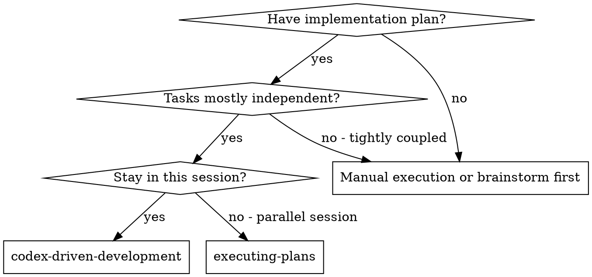
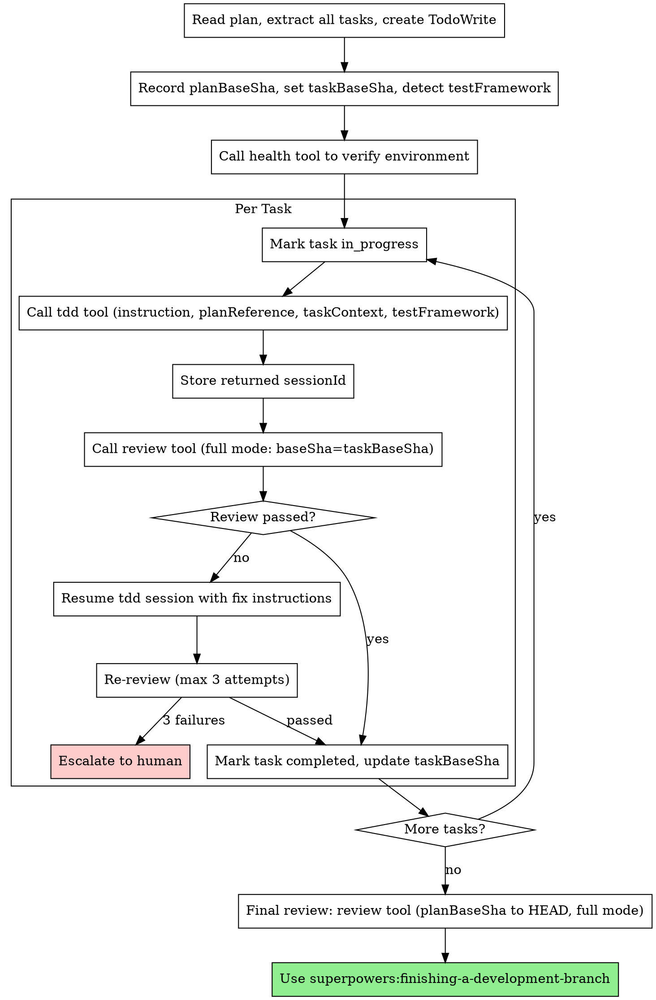

# Codex-Driven Development

Execute plan by calling mcp-codex-dev TDD tool per task, with full code review after each.

**Core principle:** Codex TDD per task + full review (spec + quality) = high quality, fast iteration

## When to Use



**vs. Executing Plans (parallel session):**
- Same session (no context switch)
- Codex CLI handles TDD internally (enforced RED-GREEN-REFACTOR)
- Full review after each task (spec compliance + code quality in one pass)
- Faster iteration (no subagent overhead, no human-in-loop between tasks)

## The Process



## Example Workflow

```
You: I'm using Codex-Driven Development to execute this plan.

[Read plan file once: docs/plans/feature-plan.md]
[Extract all 5 tasks with full text and context]
[Create TodoWrite with all tasks]
[Record planBaseSha: abc1234]
[Detect testFramework: jest]
[Call mcp__mcp-codex-dev__health — OK]

Task 1: Hook installation script

[Mark Task 1 in_progress]

[Call mcp__mcp-codex-dev__tdd]
  instruction: "Implement Task 1: Hook installation script.
    Create install-hook command that installs hooks at user level
    (~/.config/superpowers/hooks/). Support --force flag to overwrite.
    Write tests first following TDD."
  planReference: "docs/plans/feature-plan.md"
  taskContext: "Task 1 of 5: Hook installation script"
  testFramework: "jest"

[Returns: sessionId=xyz-123, summary="Implemented install-hook with --force, 5 tests passing"]

[Call mcp__mcp-codex-dev__review]
  instruction: "Task 1: Hook installation script with --force flag, user-level install"
  whatWasImplemented: "install-hook command with --force flag, 5 tests passing"
  baseSha: "abc1234"
  reviewType: "full"
  planReference: "docs/plans/feature-plan.md"
  taskContext: "Task 1 of 5: Hook installation script"

[Returns: Approved, no issues]
[Mark Task 1 completed]
[Update taskBaseSha: def5678]

Task 2: Recovery modes

[Mark Task 2 in_progress]

[Call mcp__mcp-codex-dev__tdd]
  instruction: "Implement Task 2: Recovery modes. Add verify/repair modes..."
  planReference: "docs/plans/feature-plan.md"
  taskContext: "Task 2 of 5: Recovery modes. Depends on Task 1 hook system."
  testFramework: "jest"

[Returns: sessionId=abc-456, summary="Added verify/repair, 8 tests passing"]

[Call mcp__mcp-codex-dev__review]
  instruction: "Task 2: Recovery modes with verify and repair"
  whatWasImplemented: "verify/repair modes with 8 tests"
  baseSha: "def5678"
  reviewType: "full"

[Returns: Issues found — Important: magic number 100 for progress interval]

[Resume tdd session to fix]
[Call mcp__mcp-codex-dev__tdd]
  sessionId: "abc-456"
  instruction: "Fix review issue: Extract magic number 100 to PROGRESS_INTERVAL constant"

[Call mcp__mcp-codex-dev__review — Approved]
[Mark Task 2 completed]

...

[After all tasks]
[Final review: planBaseSha=abc1234 to HEAD, full mode]
[Final review: Approved]

[Use superpowers:finishing-a-development-branch]
Done!
```

## Advantages

**vs. Manual execution:**
- Codex CLI enforces TDD methodology internally
- No context pollution between tasks (each tdd call is isolated)
- Session resume for iterative fixes

**vs. Subagent-based approaches:**
- No subagent dispatch overhead
- No context switching between separate Claude sessions
- Review fix loop is immediate (resume session, not new dispatch)
- Single orchestrator maintains full visibility

**Quality gates:**
- Full review after every task (spec compliance + code quality combined)
- Review fix loop ensures issues are actually resolved
- Final full-range review catches cross-task issues
- Max 3 review attempts before human escalation

## Red Flags

**Never:**
- Start implementation on main/master branch without explicit user consent
- Skip review after tdd (every task needs review)
- Use `exec` instead of `tdd` for implementation (bypasses TDD discipline)
- Proceed with unfixed Critical or Important issues
- Dispatch multiple tdd calls in parallel (file conflicts)
- Skip the final full-range review
- Ignore tdd tool errors — check `health` first
- Accept "close enough" on review (issues found = fix required)
- Move to next task while review has open issues

**If review finds issues:**
- Resume the tdd session with specific fix instructions
- Re-review after fix
- Repeat until approved or 3 attempts exhausted
- 3 failures → stop, escalate to human

**If tdd tool fails:**
- Call `health` to verify environment
- Check error message for guidance
- Don't retry blindly — diagnose first

## Integration

**Required background skills:**
- **superpowers:using-codex-dev** - REQUIRED: Tool parameters and session management
- **superpowers:using-git-worktrees** - REQUIRED: Set up isolated workspace before starting
- **superpowers:writing-plans** - Creates the plan this skill executes
- **superpowers:finishing-a-development-branch** - Complete development after all tasks

**Related skills:**
- **superpowers:test-driven-development** - TDD discipline (enforced by tdd tool internally)
- **superpowers:requesting-code-review** - Standalone review (used by this skill automatically)

**Alternative workflow:**
- **superpowers:executing-plans** - Use for parallel session with human checkpoints
